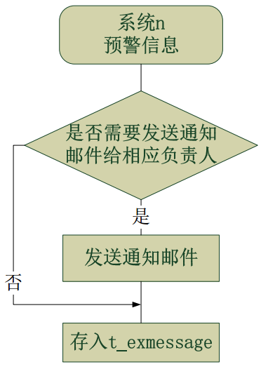

# AlertSystem

## 题目描述

中心银行实习题目一：预警中台

1. 为多个系统设计的一个web端预警中台，可以对预警信息进行增、删、查、改操作。预警信息格式自行设计，但需要包括以下内容：
   - 预警的系统名称	时间	异常描述

2. 可选实现项：
   - 预警信息的来源不依赖平台新增，有独立的Client端向Server端进行发送
   - 可以将预警信息以邮件形式发送给对应的系统负责人


## 解决方案

 <center>
         <span>
             
         </span>
 </center>

当预警信息请求到达后，先判断是否需要向相应负责人发送通知邮件，否则直接入库，是则发送通知邮件、记录发送时间、入库。

判断是否需要发送通知：通过 map 记录发送通知的时间，或者用表记录

发送通知邮件：用 system_id 查询相应负责人信息，发送通知。

### 表设计

1. ExMessage 表

   在 id 建立自增主键，在 system_id 和 ex_id 建立联合索引， 在 ex_time 建立索引加快查询排序

   | 字段名         | 描述                     |
   | -------------- | ------------------------ |
   | id             | 与业务无关自增id         |
   | system_id      | 发出预警信息的系统id     |
   | system_name    | 发出预警信息的系统名称   |
   | ex_id          | 预警信息中异常类别id     |
   | ex_time        | 预警信息中发生异常的时间 |
   | ex_description | 预警信息中异常描述       |

3. Notice表

   在 system_id 建立主键
   
   | 字段名     | 描述                 |
   | ---------- | -------------------- |
   | system_id  | 发出预警信息的系统id |
   | admin_name | 负责人姓名           |
   | admin_mail | 负责人邮箱           |
   
   

### service层接口设计

1. ExMessageService 接口:

   - 添加 系统n 发出的预警信息到数据库

     ```java
     void addExMessage(Integer systemId,
                       String systemName,
                       Integer exId,
                       String exDescription,
                       Date exTime);
     ```

   - 查询 系统n 在数据库中的信息

     ```java
     List<ExMessage> getExMessageByUniteId(Integer systemId, Integer exId);
     ```
   
  ```
     ExMessage getExMessageById(Integer id);
  ```
   
   - 删除 系统n 在数据库中的信息
   
     ```java
  void deleteExMessage(Integer id);
     ```


2. SenderService 接口:

   - 判断是否需要发送邮件给负责人

     ```java
     boolean checkNeedToSend(Date newExTime, ExMessage exMessage);
     ```

   - 发送预警信息给相应负责人

     ```java 
     void sendExMessage(ExMessage exMessage);
     ```